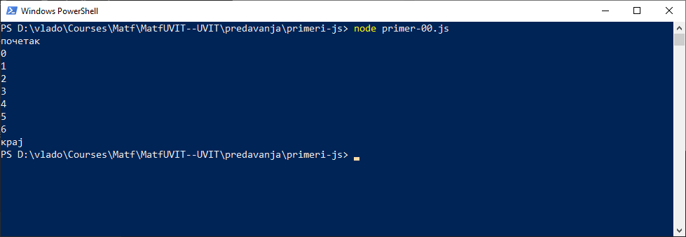
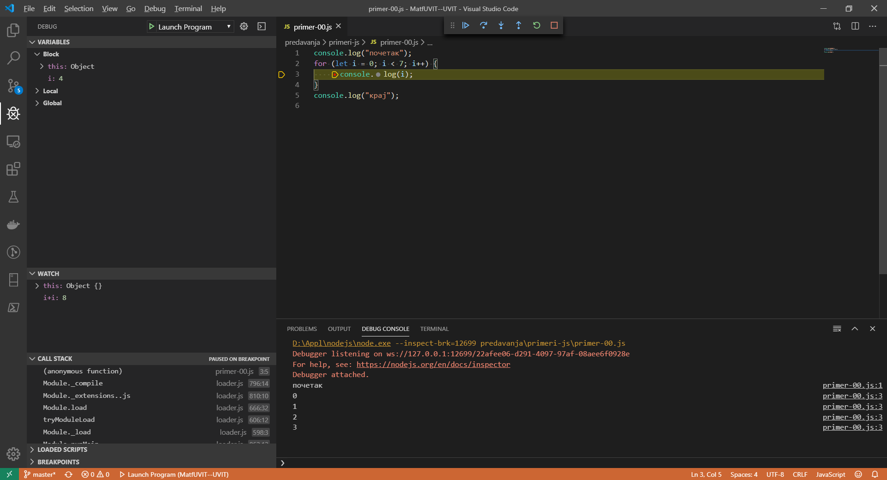
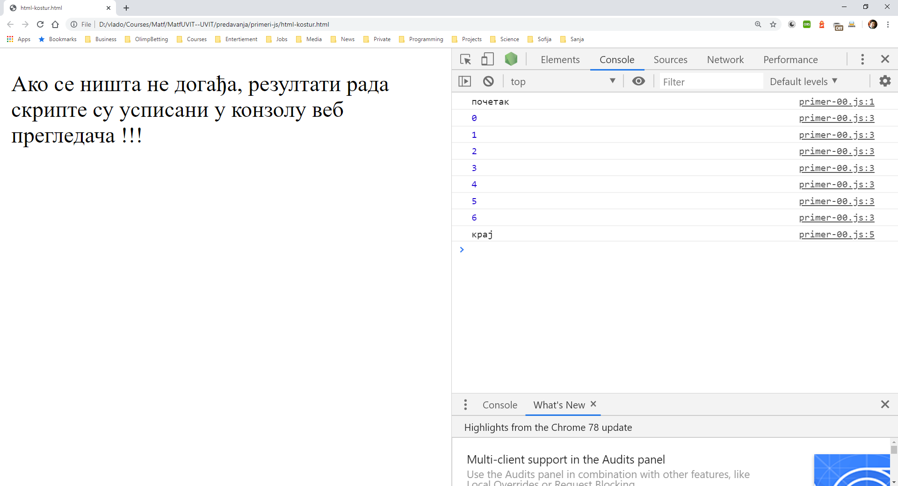

# УВИТ - Програмски језик ЈаваСкрипт

[Владимир Филиповић](https://vladofilipovic.github.io/index-cy.html){:target="_blank"}

## Историјат и верзије језика ЈаваСкрипт

### Настанак ЈаваСкрипта

Године 1993, Национални центар за суперрачунарске апликације (енгл. National Center for Supercomputing Applications - NCSA), део Универзитета у Илиноису, објавио је Mosaic, први популарни графички прегледач веба, који је одиграо значајну улогу у развоју веба у то време.

Године 1994. године у граду Маунтин Вју, у Калифорнији, основана је компанија под називом Mosaic Communcations, која је запослила већину аутора оригиналног Mosaic веб прегледача, како би развили нови прегледач, који ће заменити Mosaic.  Прва верзија тог новог прегледача, Mosaic Netscape 0.9, објављена је крајем 1994. године. За само четири месеца овај веб прегледач је већ заузео три четвртине тржишта и постао је најпопуларнији веб прегледач деведесетих година XX века. Како би избегли проблеме са ауторским правима са NCSA, веб прегледач је исте године добио нов назив, Netscape Navigator, a компанија се назвала Netscape Communications.

У овој компанији су на време схватили да би Веб требало да постане динамичнији. Оснивач компаније, Марк Андресен, тврдио је да HTML-у треба пратећи језик који веб дизајнери и програмери могу лако да користе за склапање компоненти као што су слике и додаци, чији би се код писао директно у HTML коду веб странице. Како би уопште започели са радом, компанија Netscape Communications је морала да сарађује са компанијом Sun Microsystems да би у свај прегледач уградили њихов статични програмски језик Јаву и тиме се борили са конкурентском компанијом Microsoft за већу наклоност корисника и за усвајање веб технологија и платформи.

Одлучено је да се креира програмски језик комплементаран Јави, са сличном синтаксом, што је у старту значило одбацивање подршке за друге програмске језике као што су Перл, Пајтон, TCL или Scheme. Како би одбранили идеју ЈаваСкрипта у односу на понуду конкурената, компаније је био потребан прототип. Брендон Ајк је написао прототип будућег програмског језика за 10 дана, у мају 1995. године.

Иако је развијан под кодним називом Мока, језик је званично назван Лајвскрипт приликом првог објављивања бета верзијe Netscape Navigator-a, септембра 1995. године. Међутим, језик је убрзо, у децембру исте године, прилоком објављивања Netscape Navigator 2.0 бета 3 верзије, преименован у ЈаваСкрипт.

### Верзије језика ЈаваСкрипт

- ЈаваСкрипт 1.0 - Изворна верзија језика, садржавала је већи број погрешака. Имплементирана је у веб прегледачу Netscape Navigator 2.

- ЈаваСкрипт 1.1 - Додат нови објкат `Array` за рад са низовима; поправљене озбиљне погрешке. Имплементиран јеу веб прегледачу Netscape Navigator 3.

- ЈаваСкрипт 1.2 - Додата нова наредба `switch`, регуларни изрази и др. Дееломично поштује ECMA v1 стандард уз неке некомпатибилности.
Имплементиран је у веб прегледачу Netscape Navigator 4.

- ЈаваСкрипт 1.3 - Исправљене некомпатибилности ЈаваСкриптa 1.2. Усклађеност са стандардом ECMA v1. Имплементиран је у веб прегледачу Netscape Navigator 4.5.

- ЈаваСкрипт 1.4 - Имплементиран је у веб прегледачу Netscape за серверске компоненте.

- ЈаваСкрипт 1.5 - Уведено управљање изузетцима. Поштује стандард ECMA v3. Имплементиран је у веб прегледачима Mozilla Firefox и Netscape Navigator 6.

- ЈСкрипт 1.0 - Оквирно еквивалентан ЈаваСкрипту 1.0. Имплементиран у првим верзијама веб прегледачa Internet Explorer 3.

- ЈСкрипт 2.0 - Оквирно еквивалентан ЈаваСкрипту 1.1. Имплементиран у каснијим верзијама веб прегледачa Internet Explorer 3.

- ЈСкрипт 3.0 - Оквирно еквивалентан ЈаваСкрипту 1.3. Усклађен са стандардом ECMA v1. Имплементиран је у веб прегледачу Internet Explorer 4.

- ЈСкрипт 4.0 - Није имплементиран ни у један веб прегледач.

- ЈСкрипт 5.0 - Подржано управљање изузетцима. Делимично поштује стандард ECMA v3. Имплементиран је у веб прегледачу Internet Explorer 5.

- ЈСкрипт 5.5 - Оквирно еквивалентан ЈаваСкриптu 1.5. Потпуно усклађен са стандардом ECMA v3. Имплементиран је у веб прегледачима Internet Explorer 5.5 i 6.

- ECMA v1 - Прва стандардна верзија. Стандардизоване су основе ЈаваСкриптa 1.1 и додато је неколико нових могућности. Нису стандардизоване наредба `switch` и регуларни изрази. Имплементације које поштују стандард ECMA v1 су ЈаваСкрипт
1.3 и ЈСкрипт 3.0.

- ECMA v2 - Развојна верзија која није донела нове могућности, али је разјаснила неке двосмислености.

- ECMA v3 - Стандардизована наредба `switch`, регуларни изрази и управљање изузетцима. Имплементације усклађене са стандардом ECMA v3
су ЈаваСкрипт 1.5 и ЈСкрипт 5.5.

- ECMA v4 - Ова верзија никада није заживела, због несугласица у радној групи која ју је прирпермала око тога у ком би смеру језик требало даље развијати.

- ECMA v5 - Додат је стриктни начин рада, разјашњене су многе двосмислености из стандарада ECMA v3 и додана је подршка за JSON.

- ECMA v5.1 - Дорађена верзија 5 која не садржи никакве новитете везане уз сâм језик.

- ECMA v6 - Појавио се се средином 2015. године, и додао нову синтаксу за објектно програмирање, као и још неке додатке. Ова је верзија позната и као ES6 Harmony.

### Извршавање и дебагирање ЈаваСкрипт програма

У секцији која следи, биће описано како се ЈаваСкрипт програм извршава и дебагира у два окружења за извршавање - у веб прегледачу и у node.js.

Нека се ради о следећем порграму и нека је тај програм смештен у датотеци `primer-00.js`:

```js
console.log("почетак");
for (let i = 0; i < 7; i++) {
    console.log(i);
}
console.log("крај");
```

#### Извршавње у окружењу node.js

Ако је инсталирано окружење node.js онда се програм може покренути из комадног промпта, наредбом:

```bash
node primer-00.js
```

Резултат извршавања је приказан на следећој слици:

{: style="float:center"}

#### Дебагирање у окружењу node.js коришћењем VS Code

Развојно окружење VS Code се може користити за дебагирање ЈаваСкрипт програма. Ово окружење подржава постављање тачака лома (енгл. brеakpoint) на којима се зауставља извршавање, одакле се оно може наставити корак по корак или непрекидно до краја, односно следеће постављене тачке лома. Када је извршавање програма заустављено, окружење допушта да се прочитају вредности променљивих, проучи стек позива и све елементе на њему итд. - то су мање-више могућности које имају и друга модрена развојна окружења.

{: style="float:center"}

На горњој слици се може уочити да је извршавање програма заустављено на тачки лома, да је вредност променљиве `i` у пвом заустављању `4` и да су на конзоли приказане линије `почетак`, `0`, `1`, `2` и `3`.

#### Извршавње у веб прегледачу

Како се у оквиру веб прегледача приказују веб стране, то је неопходно да се креира HTML страна која ће покретати ЈаваСкрипт програм - прецизније ЈаваСкрипт скрипту. Покретање скрипте се постиже помоћу елемента `<script>`, као у примеру који следи:  

```html
<!DOCTYPE html>
<html>
<head>
    <meta charset="UTF-8" />
</head>
<body>
    <!-- Атрибут src елемента <script> се поставља на име јавасцрипт датотеке коју треба извршити -->
    <script src="primer-00.js"></script>
    <p>
        Ако се ништа не догађа, резултати рада скрипте су усписани у конзолу веб прегледача !!!
    </p>
</body>
</html>
```

Када се покрене веб прегледач, скрипта ће бити извршена и резултат њеног рада оже да се види у конзоли веб прегледача, као на слици која следи.

{: style="float:center"}

#### Дебагирање у веб прегледачу

ЈаваСкрипт програми се могу и дебагирати у веб прегледачу, као што је приказано на следећој слици:

{: style="float:center"}

На горњој слици се може уочити да је извршавање програма заустављено на тачки лома, да је вредност променљиве `i` у пвом заустављању `4` и да су на конзоли приказане линије `почетак`, `0`, `1`, `2` и `3`.

## Стилови кŏдирања

Стил кŏдирања за ЈаваСкрипт у ствари представља скуп конвенција које се користе при писању ЈаваСкрипт програма.

Стил кŏдирања се обично описује као споразум који склапају чланови програмерског тима, како би одржали конзистентност програмског кŏда у пројекту.

Чак и ако је тим једночлан, опет се стил кŏдирања може посматрати као споразум који програмер склапа сам са собом, како би програмски кŏд био у складу са сопственим програмеровим стандардима.

Постојање фиксних правила за форматирање програмског кŏда умногоме помаже да кŏд буде читљивији и лакши за одржавање.

### Популарни стилови кŏдирања

Поред многобројних постојећих, у овом тренутку су најпопуларнији стилови кŏдирања описани са следећа два документа:

- [Google JavaScript Style Guide](https://google.github.io/styleguide/jsguide.html){:target="_blank"}

- [AirBnb JavaScript Style Guide](https://github.com/airbnb/javascript){:target="_blank"}

Уколико радите на тимском пројекту, добра је пракса да се стил кŏдирања усагласи на почетку и да се усаглашени документ постави тако да у сваком тренутку  буде доступан свим члановима тима.

### Конвенције кŏдирања које ће бити коришћене у оквиру овог курса

- У примерима и у опису конструкција биће коришћена актуелна верзија ЈаваСкрипта. Ако буде било потребе да се подрже старији прегледачи веба, биће коришћен алат [Babel](https://github.com/babel/babel){:target="_blank"}.

- Увлачење: користиће се размаци, а не табови, при чему ће нови ниво увлачења бити маркиран са три размака.

- Тачка-запета: с обзиром на навике настале при програмирању у програмском језику C, усвојено је пркаса да ће се користити знак тачка-запета на крају сваке наредбе.

- Дужина линије: ако је могуће. линије програмског кŏда пресећи тако да не буду дуже од 80 знакова.

- Линијски коментари: у програмском кŏду користити искључиво линијке коментаре; блоковске коментаре користити искључиво у документационе сврхе.

- Без "мртвог" програмског кŏда: не остављати искоментарисан стари програмски кŏд, како би, "за сваки случај" он могао бити касније коришћен. У оквиру програмског кŏда треба да остане сано садржај који је потребан, а ситуације типа "ово ми може требати касније" се решавају помоћу система за контролу верзија и програмерске документације/напомена.

- Коментарисати само када је корисно: не додавати коментаре ако они не доприносе разумевању програмског кŏда. Ако је коришћењем конвенција кŏдирања, правилним именовањем променљивих и функција програм и коришћењем [JSDoc](https://github.com/google/closure-compiler/wiki/Annotating-JavaScript-for-the-Closure-Compiler){:target="_blank"} коментара постигнуто да програм буде читљив и само-обашњавајући, тада ге не треба додатно коментарисати.

- Именовање функција, променљивих и метода: називи функција, променљивих и метода увек почињу малим словом тј. при запису се користи тзв. **камиљаНотација**. Једино у случају када се ради о називу означеном са `private`, тада назив почиње подвлаком (тј. знаком `_` ), а наставак назва је у складу са камиљомНотацијом.

- Именовање конструкторских функција и класа:  називи конструкторских функције и класа користе тзв. **ПаскалНотацију**. И ту се, слично као код камиље нотације, великом словом сигнализира почетак нове речи у називу - само што назив почиње великим, а не малим словом.

- Именовање датотека: називи датотека треба да буду написани малим словима, при чему ће речи у називу бити раздвојене цртицом (или минусом, тј. знаком - ).

- Константе: све константе се именују **ВЕЛИКИМ_СЛОВИМА**. У том случају се користи подвлаа (тј. знак `_` ) за раздвајање речи унутар имена константе.

- Декларације променљивих: увек треба декларисти променљиве, како би се на тај начин избегло "загађивање" стварањем глобалних објеката. При декларисању проеменљивих не користити `var`. Препоручује се коришћење `const` за декларацију променљиве, а `let` трба користити само у случају када ће променљивој бити мењана вредност после инцијален доделе.

- Белине: белине треба паметно користити ради повећања читљивости програмског кŏда. На пример, поставити размак иза кључне речи иза које следе отворена заграда; поставити размак пре и после бинарних операција (`+`, `-`, `*`, `/`); после сваке од секција унутар наредбе `for`; после сваког знака тачка-зарез (тј. знака `;`); после сваког зареза (тј. знака `,`), и сл.  

- Знаци за крај линије: убацити празне линије како би се раздвојиле секвенце логички повезаних операција.

- Апострофи и наводници: апостроф (тј. знак `'`) треба да има приоритет у односу на наводник (тј. знак `"`). Наиме, наводници су уобичајени код HTML атрибута, па коришљење апостофа помаже да се олакшају проблеми при раду са нискама које садрже HTML описе.

**Напомена.** Ако радни оквир који се користи или већ усвојени стандард кŏдирањњ садржи другачуја правила, онда се треба њима прилагодити. Један од популарних алата који олакшава сређивање и  форматирање програмског кода је [Prettier](https://prettier.io/){:target="_blank"}.

### Литература

1. Haverbeke M.: [Eloquent JavaScript](https://eloquentjavascript.net/){:target="_blank"}

1. [JavaScript](https://developer.mozilla.org/en-US/docs/Web/JavaScript){:target="_blank"} - Mozzila Developer Network (MDN)

1. Живановић, Д.: [Веб програмирање - ЈаваСкрипт](https://www.webprogramiranje.org/dogadjaji-u-javascript-u/){:target="_blank"}

1. Copes F.: [Complete JavaScript Handbook](https://medium.freecodecamp.org/the-complete-javascript-handbook-f26b2c71719c){:target="_blank"}
