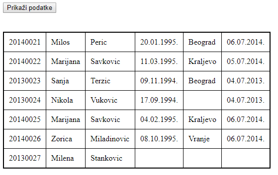

[Vežbe](../../../README.md)

[Radni priručnik](../../README.md)

-----

# 7. Sedmica 7

## 7.1 Teme

- Poglavlje 5. JavaScript i DOM

   - Sekcija 1. Osnovni koncepti DOM stabla

   - Sekcija 2. Pretraga elemenata

   - Sekcija 3. Upravljanje elementima

   - Sekcija 4. Dinamičko dodavanje i brisanje elemenata

   - Sekcija 5. Pridruživanje osluškivača događaja elementima

## 7.2 Domaći zadaci

#### Zadatak 1

Neka je data datoteka `index.html` sa narednim sadržajem koja predstavlja osnovu klijentske veb aplikacije:

```html
<!DOCTYPE html>
<html>
<head>
    <meta charset="UTF-8">
    <meta name="viewport" content="width=device-width, initial-scale=1.0">
    <title>Podaci o studentima</title>

    <style>
        table {
            border: 2px solid black;
            border-collapse: collapse;
            margin: 20px 0;
        }

        td {
            border: 1px solid black;
            padding: 10px;
        }

        .podaci {
            display: inline-block;
            width: 40%;
            height: 500px;
            vertical-align: top;
        }
    </style>
</head>
<body>
    <input type="button" id="prikazi_podatke" value="Prikaži podatke">
    <br>

    <div id="podaci" class="podaci"></div>
    <div id="odabran_student" class="podaci"></div>

    <script src="index.js"></script>
</body>
</html>
```

Zadatak je da implementiramo klijentsku veb aplikaciju koja ispunjava naredni opis. Klikom na dugme "Prikaži podatke" na stranici se prikazuju informacije o studentima u vidu tabele. Prelaskom miša preko neke od ćelija u prvoj koloni (odnosno, ćelija koje sadrže indekse), želimo da se postavi pozadinska boja te ćelije na sivu. Klikom na neku od ćelija koja sadrži indeks, želimo da se u elementu pored tabele prikažu informacije o odabranom studentu. 

***Implementacioni detalji zadatka***

Sva rešenja čuvati u datoteci `index.js`.

a) Kreirati promenljivu `studenti` koja treba da sadrži podatke o studentima iz naredne tabele. Koristiti odgovarajuće tipove podataka za predstavljanje datih vrednosti. Ova promenljiva se koristi u narednim zahtevima.

| indeks | ime | prezime | datum_rodjenja | mesto_rodjenja | datum_upisa | 
| ------ | ----| ------ | ----------- | -------------- | -------------- |
| 20140021 | Milos    | Peric       | 20.01.1995. | Beograd | 06.07.2014.  | 
| 20140022 | Marijana | Savkovic    | 11.03.1995. | Kraljevo | 05.07.2014. | 
| 20130023 | Sanja    | Terzic      | 09.11.1994. | Beograd | 04.07.2013.  | 
| 20130024 | Nikola   | Vukovic     | 17.09.1994. |   | 04.07.2013. | 
| 20140025 | Marijana | Savkovic    | 04.02.1995. | Kraljevo | 06.07.2014. | 
| 20140026 | Zorica   | Miladinovic | 08.10.1995. | Vranje | 06.07.2014. | 
| 20130027 | Milena   | Stankovic   |  |  | |

b) Napisati funkciju `kreiraj_red_tabele(student)` koja kreira objekat koji predstavlja red tabele, pri čemu svaka ćelija u redu odgovara vrednostima koje su sadržane u promenljivoj `student`. Ne koristiti svojstva `innerHTML` i `outerHTML` za dinamičko dodavanje elemenata.

c) Napisati funkciju `postavi_hover_stil()` koja nad *objektom koji je poziva kao metod* (`this`) postavlja pozadinsku boju na sivu.

d) Napisati funkciju `ukloni_hover_stil()` koja nad *objektom koji je poziva kao metod* (`this`) postavlja pozadinsku boju na belu.

e) Napisati funkciju `odaberi_studenta()` koja redom:
   - Briše sadržaj elementa sa identifikatorom `odabran_student`.
   - U element sa identifikatorom `odabran_student` dodaje naslov sa tekstom.
   - Pronalazi studenta iz niza `studenti` na osnovu indeksa koji se nalazi kao sadržaj *objekta nad kojim se funkcija poziva kao metod* (`this`).
   - U element sa identifikatorom `odabran_student`, za svaku vrednost koja se sadrži u pronađenom studentu, dodaje po jedan paragraf čiji je sadržaj kao na narednoj slici.
   

f) Napisati funkciju `postavi_osluškivače_nad_prvom_kolonom()` koja nad prvom tabelom u dokumentu pronalazi prve ćelije u svakom redu tabele, i za svaku od tih ćelija redom:
   - Postavlja osluškivač `postavi_hover_stil` za događaj `'mouseenter'`
   - Postavlja osluškivač `ukloni_hover_stil` za događaj `'mouseleave'`
   - Postavlja osluškivač `odaberi_studenta` za događaj `'click'`

g) Napisati funkciju `prikaži_podatke()` koja redom:
   - Kreira tabelu na osnovu podataka iz promenljive `studenti` kao na narednoj slici. Dozvoljeno je korišćenje funkcije `kreiraj_red_tabele`. Ne koristiti svojstva `innerHTML` i `outerHTML` za dinamičko dodavanje elemenata.
   
   - Postavlja osluškivače pozivom funkcije `postavi_osluškivače_nad_prvom_kolonom`.

   Takođe, postaviti osluškivač `prikaži_podatke` za događaj `'click'` nad dugmetom čiji je identifikator `prikazi_podatke`.

h) Obraditi sve greške u implementaciji.

#### Zadatak 2

Neka je data datoteka `index.html` sa narednim sadržajem koja predstavlja osnovu klijentske veb aplikacije:

```html
<!DOCTYPE html>
<html lang="sr">

<head>
    <meta charset="UTF-8">
    <meta name="viewport" content="width=device-width, initial-scale=1.0">
    <title>Domaći 2</title>

    <link rel="stylesheet" type="text/css" href="index.css">
</head>

<body>
    <h1>Moja TO-DO lista</h1>

    <div id="nova-stavka">
        <label for="datum">Odaberite datum:</label>
        <input type="date" id="datum">

        <label for="tekst">Unesite podsetnik:</label>
        <input type="text" id="tekst">

        <input type="button" value="Unesi novi podsetnik" id="napravi-todo">
    </div>

    <div id="lista"></div>

    <script src="index.js"></script>
</body>

</html>
```

Zadatak je da implementiramo klijentsku veb aplikaciju koja ispunjava naredni opis. Korisnik treba da unese datum u polje "Odaberite datum" i tekst u polje "Unesite podsetnik". Klikom na dugme "Unesi novi podsetnik" na stranici se prikazuje nova stavka "To-do" liste. Prikaz aplikacije je dat na narednoj slici.


***Implementacioni detalji zadatka***

Sva rešenja čuvati u datoteci `index.js`.

a) Na početku je lista prazna. Kreirati globalnu promenljivu `toDoLista` koja predstavlja prazan niz obaveza. Ova promenljiva se koristi u narednim zahtevima.

b) Napisati funkciju `prikažiListu()` koja redom:
   - Briše sve elemente iz sadržaja elementa sa identifikatorom `lista`.
   - Za svaku stavku iz promenljive `toDoLista` kreira dete čvor elementa sa identifikatorom `lista`, pri čemu novokreirani čvor treba da zadovoljava naredni HTML i CSS kod:

```html
<div class="stavka">
    <p style="font-style: italic; margin-left: 10px;">
        Podsetnik za datum DATUM_PODSETNIKA:
    </p>
    <p style="width: 80%; margin: auto; word-wrap: break-word;">
        TEKST_PODSETNIKA
    </p>
</div>
```

`DATUM_PODSETNIKA` i `TEKST_PODSETNIKA` treba da budu zamenjeni datumom i tekstom iz stavke liste (videti sliku iznad). Ne koristiti svojstva `innerHTML` i `outerHTML` za dinamičko dodavanje ili brisanje elemenata.

c) Napisati funkciju `dodajStavkuListe()` koja redom:
   - Dohvata informaciju o datumu iz elementa sa identifikatorom `datum` i provera da li je korisnik uneo datum (da li je vrednost polja prazna niska).
   - Dohvata informaciju o tekstu podsetnika iz elementa sa identifikatorom `tekst` i provera da li je korisnik uneo taj tekst (da li je vrednost polja prazna niska).
   - Ukoliko su svi podaci uneti, kreira novu stavku koja sadrži te dve informacije i pamti je u promenljivu `toDoLista`.
   - Poziva funkciju `prikažiListu` da bi se osvežio prikaz obaveza na stranici.

Ne koristiti svojstva `innerHTML` i `outerHTML` za dinamičko dodavanje ili brisanje elemenata.

d) Pridružiti funkciju `dodajStavkuListe` kao osluškivač elementa sa identifikatorom `napravi-todo` na događaju kliktaj miša.

e) Obraditi sve greške u implementaciji.

-----

[Radni priručnik](../../README.md)

[Vežbe](../../../README.md)
